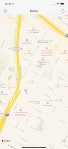

# Photography Book
iOS Application desgined to connect local photographers together through events. Users can post events and attend others. The purpose of this application is to host meetup for photographers to share ideas and capture beautiful moments. It is built using the MVC design pattern.

# Screenshots
 </img>
 </img>
 </img>

# How to run
Clone the repo and run .xcworkspace file after unzipping with XCode.
if there are any issues while running it might be because Firebase
access rules.
# Technologies
1. Swift
2. Firebase
3. Podfiles
4. Apple Maps
5. Xcode
6. XIB
